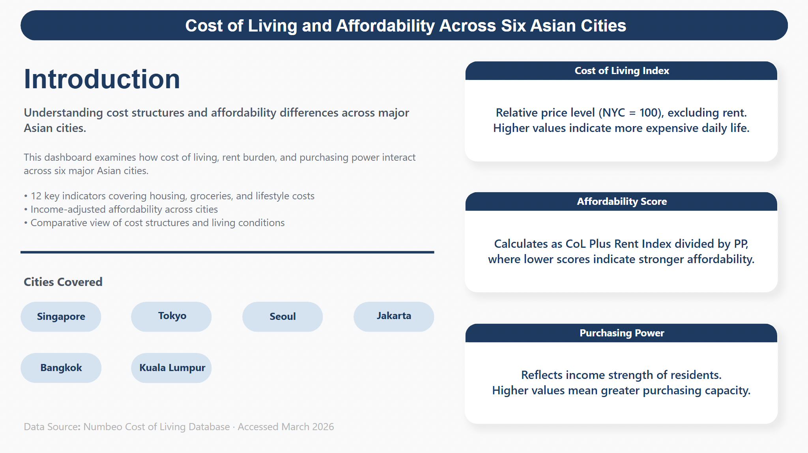
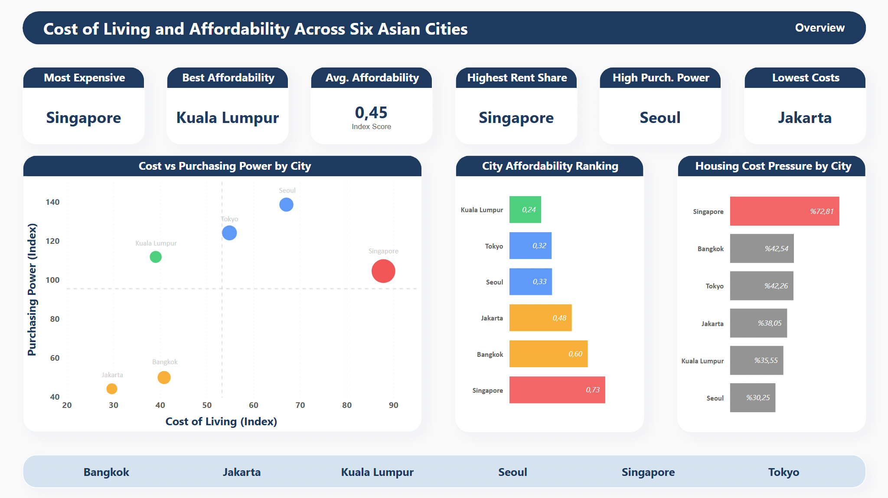
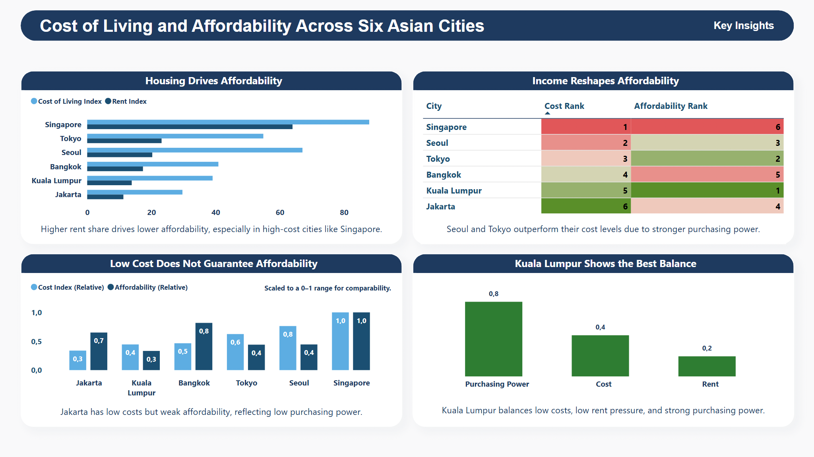
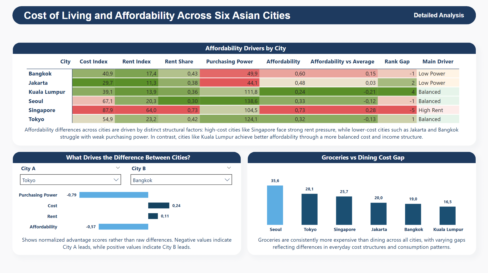

# Cost of Living and Affordability Across Six Asian Cities

This project analyzes cost structures and affordability across six major Asian cities using Excel and Power BI.

## Project Scope

The analysis compares:
- Singapore
- Tokyo
- Seoul
- Jakarta
- Bangkok
- Kuala Lumpur

It focuses on how cost of living, rent burden, and purchasing power interact to shape affordability outcomes.

## Tools Used

- **Excel** for data cleaning, structuring, and metric calculation
- **Power BI** for dashboard design, interactive analysis, and storytelling

## Core Metric

The main affordability metric used in the project is:

**Affordability = (Cost of Living + Rent Index) / Purchasing Power Index**

Lower affordability scores indicate stronger affordability.

## Key Analytical Themes

- Cost of living differences across six Asian cities
- Rent as a structural driver of affordability pressure
- Purchasing power as a key affordability reshaper
- Relative affordability ranking across cities
- Grocery vs dining cost gap
- City-to-city comparison using normalised advantage scores

## Dashboard Pages

### 1. Introduction
Provides project context, metric definitions, and scope.

### 2. Overview
Presents KPI cards and high-level visual summaries of cost, affordability, and purchasing power.

### 3. Key Insights
Highlights major findings, including:
- housing pressure in expensive cities
- the role of income in reshaping affordability
- why low cost does not always mean strong affordability
- Kuala Lumpur’s balanced profile

### 4. Detailed Analysis
Includes:
- an affordability driver matrix
- a city-to-city comparison view
- grocery vs dining cost gap analysis

## Files

- `data/Cost_of_Living_Affordability_Model_Asia.xlsx` → Excel model and calculated metrics
- `powerbi/Cost_of_Living_and_Affordability_Across_Six_Asian_Cities.pbix` → Power BI dashboard
- `assets/` → dashboard screenshots

## Project Highlights

- Built a custom affordability model using cost, rent, and purchasing power
- Designed a multi-page Power BI dashboard for comparative city analysis
- Combined descriptive, diagnostic, and comparative analytics in a single reporting flow

## Preview

### Introduction

### Overview

### Key Insights

### Detailed Analysis

